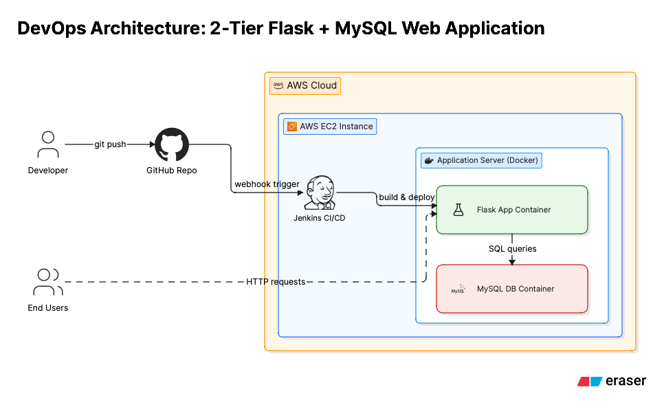

# Automated CI/CD Pipeline:2-Tier-Flask-MYSQL Deployment on AWS

**Author:** Dhruv Bhatia
**Project Focus:** Automating end-to-end deployment using Jenkins and Docker.

---

### **Table of Contents**
1. [Project Overview](#1-project-overview)
2. [Infrastructure Design](#2-infrastructure-design)
3. [Step 1: AWS EC2 Instance Preparation](#3-step-1-aws-ec2-instance-preparation)
4. [Step 2: Install Dependencies on EC2](#4-step-2-install-dependencies-on-ec2)
5. [Step 3: Jenkins Installation and Setup](#5-step-3-jenkins-installation-and-setup)
6. [Step 4: GitHub Repository Configuration](#6-step-4-github-repository-configuration)
    * [Dockerfile](#dockerfile)
    * [docker-compose.yml](#docker-composeyml)
    * [Jenkinsfile](#jenkinsfile)
7. [Step 5: Jenkins Pipeline Creation and Execution](#7-step-5-jenkins-pipeline-creation-and-execution)
8. [Conclusion](#8-conclusion)

---

### **1. Project Overview**
This project demonstrates the end-to-end automation of a 2-tier web application(Flask + MYSQL) deployment. The infrastructure is hosted on AWS EC2, and the deployment process is containerized using Docker and Docker Compose. A robust CI/CD pipeline,built with jenkins, ensure that code changes are automatically tested and deployed upon pusing to github.

---

### **2. Infrastructure Design**

